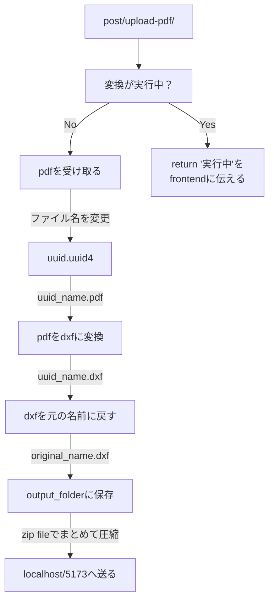
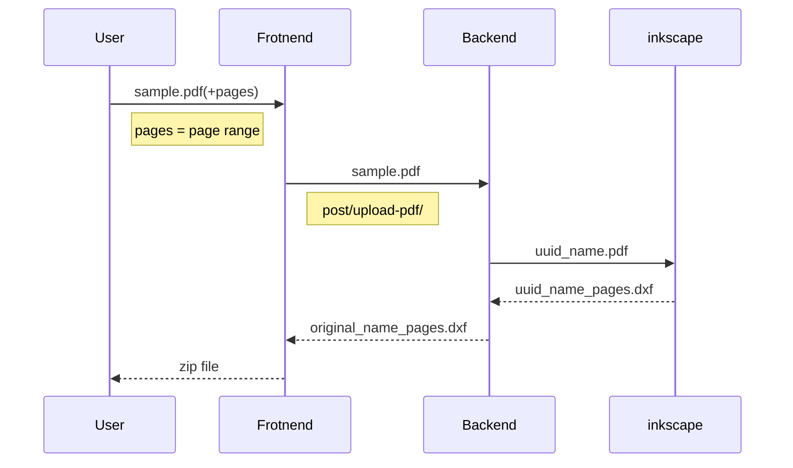

# pdf to dxf web application

## how to run
```bash
poetry install
poetry shell
uvicorn main:app --reload --host 0.0.0.0
```

## flowchart

```mermaid
    flowchart TD
    A[post/upload-pdf/] --> B[変換が実行中？]
    B --> |No| C[pdfを受け取る]
    C --> |ファイル名を変更| E[uuid.uuid4]
    E --> |uuid_name.pdf| G[pdfをdxfに変換]
    G --> |uuid_name.dxf| H[dxfを元の名前に戻す]
    H --> |original_name.dxf| I[output_folderに保存]
    I --> |zip fileでまとめて圧縮| J[localhost/5173へ送る]
    B --> |Yes| M[return '実行中'を
                        frontendに伝える]
```

## sequence

```mermaid
sequenceDiagram
participant U as User
participant F as Frotnend
participant B as Backend
participant I as inkscape

U ->>F:sample.pdf(+pages)
Note right of U:pages = page range

F ->>B:sample.pdf
Note right of F:post/upload-pdf/

B ->>I:uuid_name.pdf
I -->>B:uuid_name_pages.dxf
B -->>F:original_name_pages.dxf
F -->>U:zip file
```